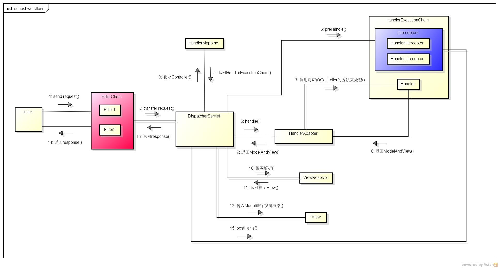
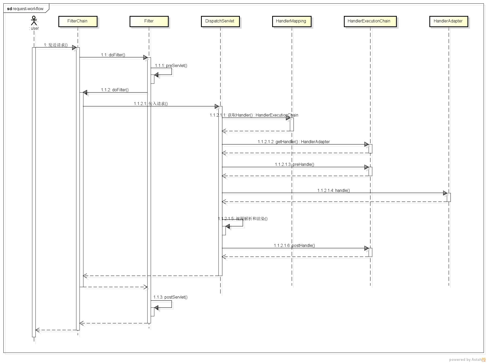
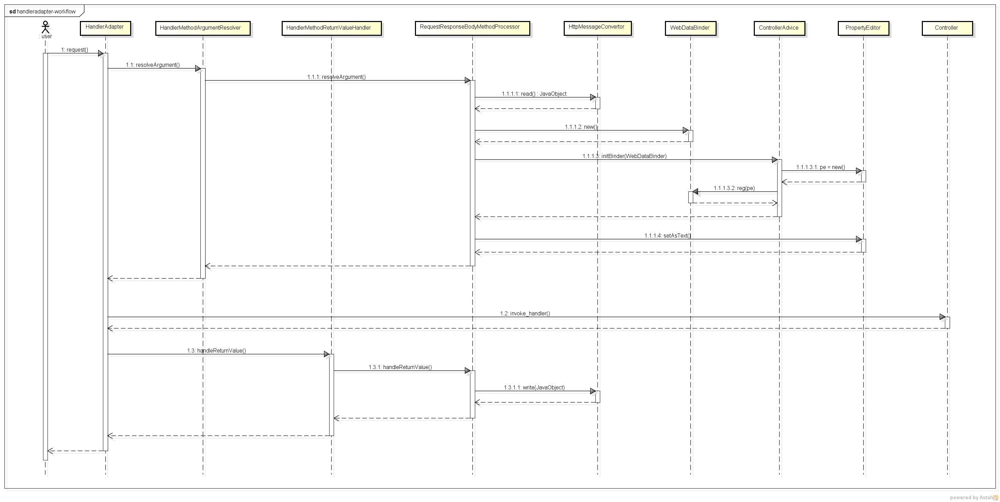

# Spring --- 请求处理流程

- Filter
- DispatcherServlet
- Interceptor
- HandlerAdapter

web程序启动时的初始化顺序: ServletContext -> listener -> filter -> servlet

spring bean的初始化是在listener中声明的, 可以在后面使用.





## Filter

- Servlet规范规定的，只能用于Web程序中, 由Servlet容器提供支持
- 作用于Servlet执行前后

```
@Order(1)
@WebFilter(filterName = "customized", urlPatterns = "/*")
public class CustomizedFilter implements Filter {
    @Override
    public void init(FilterConfig filterConfig) throws ServletException {
        log.info("CustomizedFilter Init");
    }

    @Override
    public void doFilter(ServletRequest servletRequest, ServletResponse servletResponse, FilterChain filterChain) throws IOException, ServletException {
        log.info("CustomizedFilter doFilter before");

        // 执行Servlet
        filterChain.doFilter(servletRequest, servletResponse);

        log.info("CustomizedFilter doFilter after");
    }

    @Override
    public void destroy() {
        log.info("CustomizedFilter destroy");
    }
}
```

必须要注解**ServletComponentScan**才能让自定义的Filter其效果.

在filterChain.doFilter调用的前后来执行操作, 作用于Servlet之前的前后.

## DispatcherServlet

为Spring框架定制的Servlet, 用来对请求进行处理

- 获取请求处理链HandlerExecutionChain
- 通过HandlerAdapter将请求发送给Controller进行处理
- 对视图进行解析并将Model传递给视图View, 生成response

## Interceptor

- 作用于Handler/Controller前后执行
- 不能修改request

在spring中优先使用Interceptor

```
public class CustomizedInterceptor extends HandlerInterceptorAdapter {

    @Override
    public boolean preHandle(HttpServletRequest request, HttpServletResponse response, Object handler)
            throws Exception {
        log.info("CustomizedInterceptor prehandle");
        return true;
    }

    @Override
	public void postHandle(HttpServletRequest request, HttpServletResponse response, Object handler,
			@Nullable ModelAndView modelAndView) throws Exception {
		log.info("CustomizedInterceptor postHandle");
	}

	@Override
	public void afterCompletion(HttpServletRequest request, HttpServletResponse response, Object handler,
			@Nullable Exception ex) throws Exception {
		log.info("CustomizedInterceptor afterCompletion");
	}

}

// 添加interceptor
@Configuration
public class AppServiceConfig extends WebMvcConfigurationSupport {

    @Autowired
    private CustomizedInterceptor customizedInterceptor;

    @Override
    protected void addInterceptors(InterceptorRegistry registry) {
        registry.addInterceptor(customizedInterceptor).addPathPatterns("/**");
    }
}
```

## HandlerAdapter



- 请求流到POJO对象的转换
- 请求的handler方法调用
- ExceptionHandler异常统一处理

当使用**RequestBoddy/ResponseBody**注解时, Spring将使用**HttpMessageConverter**
对用户请求以及Handler的处理结果进行**请求流和POJO对象**之间的转换.

POJO对象转换的处理方式:

- HttpMessageConverter, spring框架的组件, 用于对body进行转换
- WebDataBinder的PropertyEditor, JDK的组件, 从字符串转换到具体的类型, 主要用于对PathVariable参数进行转换
- 自定义**HandlerMethodArgumentResolver和HandlerMethodReturnValueHandler**来映射Controller中的方法参数和返回结果

当所有的参数没解析完毕后, POJO对象列表会被传递给handler方法, 用于获取handler方法中的对应参数.

## Reference

[源码](https://github.com/xiayy860612/JavaResearch/tree/master/spring/spring-request-workflow)


Servlet规范:

- [JSR 340: Java Servlet 3.1 Specification](https://jcp.org/en/jsr/detail?id=340)
- [中文翻译](https://waylau.gitbooks.io/servlet-3-1-specification/content/)

参考文章:

- [SpringMVC系列（一）核心：处理请求流程](https://blog.csdn.net/zhaolijing2012/article/details/41596803)
- [Spring Boot :Request请求处理流程](http://www.cnblogs.com/cnndevelop/p/7255622.html)
- [Spring MVC工作流程以及请求处理流程](http://www.51gjie.com/javaweb/909.html)
- [码农小汪-Spring MVC -DispatcherServlet 详解](https://blog.csdn.net/u012881904/article/details/51292211)
- [Servlet 工作原理解析](https://www.ibm.com/developerworks/cn/java/j-lo-servlet/index.html)
- [Spring filter和拦截器(Interceptor)的区别和执行顺序](https://www.cnblogs.com/ycpanda/p/3637312.html)
- [Spring Boot 使用 Servlet、Filter、Listener](http://fanlychie.github.io/post/spring-boot-servlet-filter-listener-usage.html)
- [SpringMVC源码剖析（五)-消息转换器HttpMessageConverter](https://my.oschina.net/lichhao/blog/172562)
- [Spring MVC HandlerMapping HandlerAdapter](https://leokongwq.github.io/2015/04/17/springMVCOutlines.html)
- [SpringMVC中WebDataBinder的应用及原理](https://blog.csdn.net/hongxingxiaonan/article/details/50282001)
- [说说Spring中的WebDataBinder](https://blog.csdn.net/u010913106/article/details/50855691)
- [Spring Boot：定制HTTP消息转换器](https://www.jianshu.com/p/ffe56d9553fd)